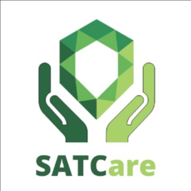

# SATC ABP - Front End

## Projeto: <b>SATCare</b>



<br>

## Integrantes
* Arthur de Luca Honorato
* Guilherme Machado Darabas
* Paulo Roberto Simão
* Rubens Scotti Junior
* Stephan  Anthony  Marques

<br>

## Descrição do Projeto

<p style="text-indent: 5px; margin-left:10px;">
SATCare é um webapp de agendamento de consultas odontológicas e psicológicas para funcionários da instituição SATC.
Com a possibilidade de agendar, cancelar e visualizar suas consultas, os funcionários poderão gerenciar
seus atendimentos com mais facilidade e comodidade.
</p>

<br>

## Objetivo

<p style="text-indent: 5px; margin-left:10px;">
O objetivo do SATCare é resolver o problema da dificuldade de agendamento de consultas odontológicas e psicológicas 
para funcionários da instituição SATC. Com a utilização do webapp, os funcionários poderão agendar suas
consultas de forma rápida e fácil, sem precisar se deslocar até o setor de assistência social para marcar horário.
</p>

<br>

## Estrutura do Projeto

* Tela de login
* Tela de cadastro de usuário
* Tela de cadastro de profissionais
* Tela de cadastro de consulta
* Tela de cadastro de serviços
* Tela de cadastro de horários de atendimento
* Tela de visualização de usuários
* Tela de visualização de consultas agendadas
* Tela de cancelamento de consulta

<br>

## Público Alvo
<p style="text-indent: 5px; margin-left:10px;">
O app visa otmizar o processo de agendamento do horário no dentista e psicólogo da SATC. Hoje o funcionário não tem 
nenhuma ferramenta que possa consultar os horários disponíveis e nem solicitar o agendamento, para realizar 
esses processos, é necessário que o colaborador vá até o setor de assistência social ou entre em contato com 
o setor por outros meios, para que a assitente social informe os possíveis horários e faça o agendamento. O 
processo é lento e pouco eficiente, com nosso app de agendamento o colaborador concluirá o processo, que hoje 
pode levar mais de um dia, em poucos minutos.
</p>

<br>

## Tecnologias

* React
* Vitejs
* TypeScript
* Antd

<br>

## Diferenciais
<p style="text-indent: 5px; margin-left:10px;">
Interface de usuário amigável e intuitiva
Agendamento de consultas em tempo real, sem a necessidade de esperar por um atendente
Possibilidade de visualizar as consultas agendadas de forma clara e organizada
Sistema de cancelamento de consultas fácil e prático
Integração com a agenda dos dentistas, para evitar conflitos de horário.
</p>

## Instalar e Rodar

```bash
npm install

npm run dev
```